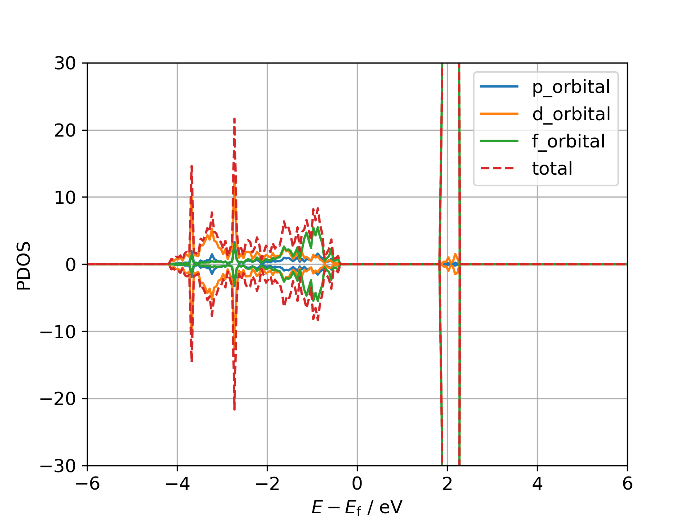
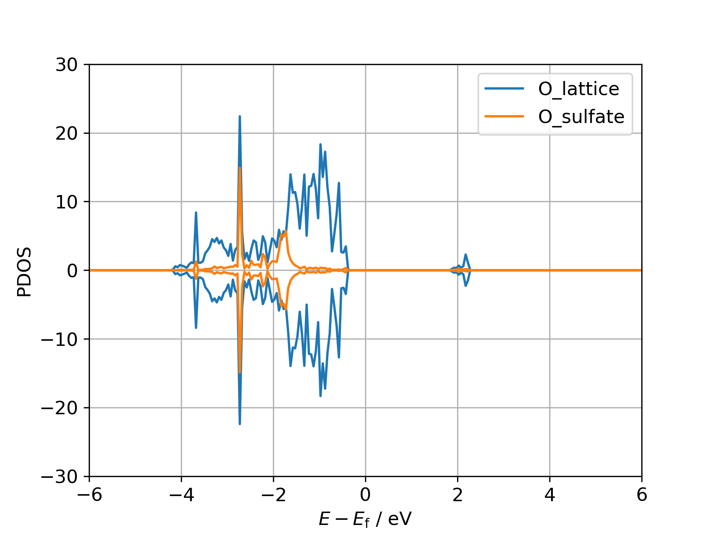

## DOS-Visualizer
A simple code to visualize VASP results.

### Feature
This code creates figures from DAT files of PDOS generated by VASPKIT.

## Requirement
[VASP][1], [VASPKIT][2] and [Matplotlib][3]  

[1]: https://www.vasp.at/
[2]: https://vaspkit.com/
[3]: https://matplotlib.org/

### Usage
If you have following directories.  
```
test/
├ CeO2_H2SO4_OPT/
│   └ VASP input and output files
├ CeO2_H2SO4_CHG/
│   └ VASP input and output files
└ CeO2_H2SO4_DOS/
    └ VASP input and output files
```
First, create a new directory named "dos_dat" in the DOS calculation directory.  
Then, put PDOS_A\*_UP/DW.dat files generated by VASPKIT into the "dos_dat".  
For example,  
```
cd DOS-Visualizer/test/CeO2_H2SO4_DOS/
mkdir dos_dat
cp INCAR POSCAR DOSCAR dos_dat/
cd dos_dat
```
Here, INCAR, POSCAR and DOSCAR files are required by VASPKIT to generate DAT files of PDOS.  
Run VASPKIT in "dos_dat".  
```
vaspkit
11
112 or 113
```
Now, you have following files.  
This code only use PDOS_A*_UP/DW.dat.  
```
test/
├ CeO2_H2SO4_OPT/
├ CeO2_H2SO4_CHG/
└ CeO2_H2SO4_DOS/
    ├ VASP input and output files
    └ dos_dat/
        ├ INCAR
        ├ POSCAR
        ├ DOSCAR
        ├ FERMI_ENERGY
        ├ SELECTED_ATOM_LIST
        ├ IPDOS_A*_UP/DW.dat
        └ PDOS_A*_UP/DW.dat
```
Next, create an INI file in "test" directory (any place is fine).  
The INI file must contain at least the following settings.  
```
[Section_name]
job = /path/to/your/dos/calculation
atoms = atom indexcies of each group (comma-delimited)
orbitals = specify orbitals to display (same number of groups as "atoms")
```
In particular,
```
[FIG1]
job = CeO2_H2SO4_DOS
atoms = 145-148, 149, 150 151
orbitals = tot, tot, tot
```
See /DOS-Visualizer/test/dos_fig.ini for more details.  
And finally, execute this program to generate figures.  
```
/path/to/make_dos_fig.py -f /path/to/ini/file
```
If you are in "test" directory,
```
../src/make_dos_fig.py -f dos_fig.ini
```
After that, figures of PDOS are generated in the directories of DOS calculation.  

Ce_orbitals_pdos.png  


O_atoms_pdos.png  


### References of DOS calculation
1. https://www.vasp.at/tutorials/latest/bulk/part1/#bulk-e02
2. https://vaspkit.com/tutorials.html#extract-and-output-dos-and-pdos
3. https://www.youtube.com/watch?v=RYziHtNFaPs&t=2192s&ab_channel=RasoulKhaledi

### Contributor
Kai Oshiro (@Kai-Oshiro)
